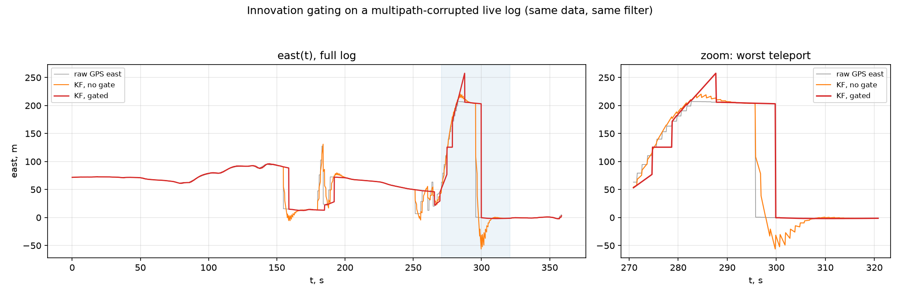
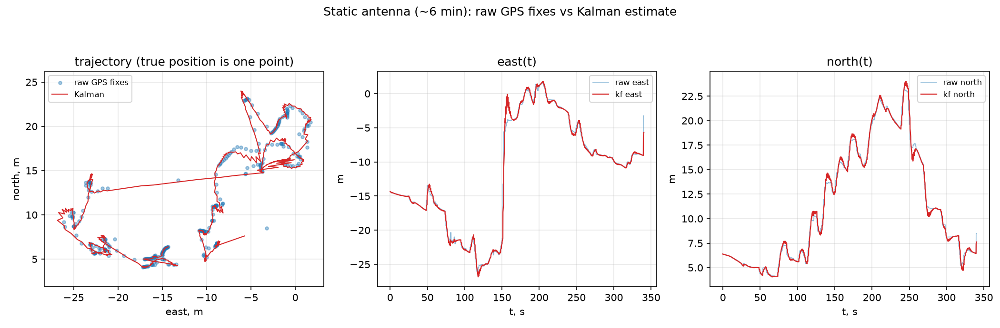
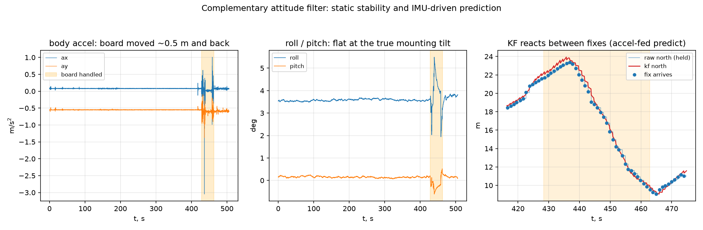

# stm32-gps-imu-fusion

Loosely-coupled GPS/IMU sensor fusion running on an STM32F446 (Nucleo-F446RE): a 4-state
linear Kalman filter estimates position and velocity in a local ENU frame from u-blox
NMEA fixes, while a complementary attitude filter turns raw accelerometer/gyro data into
roll/pitch/yaw and feeds gravity-compensated ENU accelerations into the filter's predict
step. Robust NMEA parsing, χ²-innovation gating with a Doppler cross-check, and GPS-outage
handling are all part of the pipeline. The estimation core is plain C with no HAL
dependencies, so the exact code that runs on the MCU is built and unit-tested on the host,
and validated by replaying real recorded logs.

## Results on real logs

**Innovation gating.** The same corrupted live log (multipath teleports up to 205 m)
replayed through the same filter with gating off and on. Without the gate the filter
follows every teleport and oscillates on recovery; with the gate transient jumps are
rejected outright, and a sustained shift triggers a consistency-guarded re-lock instead
of a velocity runaway:



**Static antenna.** Raw GPS wanders several meters (correlated drift, ~8 m std east);
the filter tracks it smoothly without adding lag or bias:



**Attitude + IMU-driven prediction.** Roll/pitch sit flat at the board's true mounting
tilt (3.6° ± 0.06°) for minutes, and when the board is physically moved the filter
responds from accelerometer input *between* GPS fixes — the position estimate turns
before the next fix arrives:



## Architecture

```
LSM6DS3 ──I2C──▶ accel.c ──▶ attitude.c ──▶ aE,aN ─┐
                 (SI units,   (roll/pitch/yaw,      ▼
                  bias cal)    body→ENU)         kalman.c ──▶ CSV telemetry
                                                    ▲          (USART2 / VCP)
NEO-6M ──UART──▶ gps.c ─────▶ geo.c ────▶ zE,zN ───┘
                 (DMA+NMEA)   (ENU projection)
```

| Module | Responsibility |
|---|---|
| `accel.c` | LSM6DS3 driver: 104 Hz accel+gyro, honest SI units (m/s², rad/s), BDU + auto-increment, single 12-byte burst read, gyro bias calibration at startup, finite I2C timeouts with soft-fail and bus recovery — a dead sensor never hangs the board |
| `gps.c` | UART reception via idle-line circular DMA → line assembler → lock-free ring of NMEA sentences; RMC parser (XOR checksum, empty fields, N/S/E/W, `$GNRMC`/`$GPRMC`, knots→m/s), double-precision lat/lon |
| `geo.c` | Equirectangular projection of lat/lon to local ENU meters; pure math, no HAL |
| `attitude.c` | Complementary filter (α = 0.98): roll/pitch from gyro integration corrected by the accel gravity vector; yaw from gyro-z integration corrected by GPS course-over-ground only above a speed threshold; body→ENU rotation of accelerations |
| `kalman.c` | 4-state linear KF `[pE, pN, vE, vN]`: float-only, no malloc, no HAL, hand-unrolled matrix math; continuous white-noise-acceleration process noise (predict-rate invariant); innovation gating, re-lock and outage velocity decay live here |
| `main.c` | Glue inside CubeMX USER CODE blocks: sensor loop, real-`dt` bookkeeping, origin latching on first fix, CSV telemetry |

**Why the Kalman filter stays linear.** All nonlinearity — orientation estimation,
gravity compensation, the body→ENU rotation — is confined to the attitude layer. By the
time data reaches the filter, the measurement is already a position in meters and the
control input is already an acceleration in the same frame, so the filter is a plain
linear KF: no Jacobians, no linearization error, trivially unit-testable, and numerically
well-behaved in single precision on a Cortex-M4.

## Features

- Honest sensor units and startup gyro bias calibration; burst register reads
- NMEA parser that survives real-world data: checksum verification, empty fields, both
  `$GNRMC` and `$GPRMC`, hemisphere signs, no `sscanf`
- Idle-line DMA UART reception — sentences are framed by hardware, not by polling luck
- χ²-innovation gating (Mahalanobis distance vs χ²(2, 99%) = 9.21) — teleports are
  rejected without touching the covariance
- Doppler cross-check: a position jump implying speed far above the receiver's own
  reported speed is rejected regardless of the gate
- Consistency-guarded re-lock: after N consecutive rejections the filter re-locks onto
  the measurement — but only if the Doppler check agrees, so it does not chase multipath
- Velocity decay during GPS outages (exponential, τ = 10 s after 5 s without an accepted
  fix) — dead-reckoning cannot run away
- 13 host-side unit tests covering trajectory RMSE, covariance convergence, 30–60 s
  outages, gating scenarios, attitude convergence and gravity compensation
- Replay infrastructure: the firmware's exact filter code re-run offline on recorded CSV
  logs, with plotting tools for raw-vs-filtered comparison

## Hardware

| Connection | STM32 pin | Peripheral | Notes |
|---|---|---|---|
| LSM6DS3 SCL | PB6 | I2C1 | address 0x6B, WHO_AM_I 0x69 |
| LSM6DS3 SDA | PB7 | I2C1 | |
| NEO-6M TX | PA10 | USART1 RX | 9600 baud, NMEA |
| NEO-6M RX | PA9 | USART1 TX | unused (no config sent) |
| Telemetry | PA2/PA3 | USART2 | 115200 baud → ST-LINK virtual COM port |

Board: Nucleo-F446RE (STM32F446RET6, Cortex-M4F @ 180 MHz).

## Build & flash

Firmware (arm-none-eabi toolchain, CMake presets — works out of the box with the VS Code
STM32 extension):

```sh
cmake --preset Debug
cmake --build build/Debug
```

Flash over the on-board ST-LINK:

```sh
STM32_Programmer_CLI -c port=SWD -w build/Debug/Akseler_a.elf -rst
```

Telemetry appears on the ST-LINK VCP at 115200 as CSV:
`t_ms,ax,ay,az,gx,gy,gz,fix,east,north,spd,kf_east,kf_north,kf_vE,kf_vN,gate,roll,pitch,yaw`.

Host tests (native gcc, no embedded toolchain needed):

```sh
cmake -S tests -B tests/build -G Ninja -DCMAKE_C_COMPILER=gcc
cmake --build tests/build
ctest --test-dir tests/build
```

`tests/build/replay_static <log.csv> <out.csv> [gate|att]` replays a recorded log through
the filter; `tools/plot_kf.py` plots raw vs filtered trajectories (see
`tools/requirements.txt`).

## Known limitations

- **Slow GPS drift is not observable.** With a single position source the filter cannot
  distinguish meter-scale correlated GPS drift from true motion; it tracks it. Multipath
  that stays self-consistent (position walking while reported speed agrees) passes the
  Doppler check by construction.
- **Yaw drifts.** Without a magnetometer, yaw is a gyro integral corrected only by GPS
  course above 2.5 m/s; when stationary it slowly wanders.
- **Gravity leakage during fast attitude transients.** The complementary filter lags
  rapid tilting, so a fraction of gravity briefly appears as horizontal acceleration and
  integrates into velocity until the next accepted fix pulls it back.

Natural extensions: a barometer for a 6-state filter with altitude, a magnetometer to fix
yaw, or an EKF if the attitude and position estimation are ever merged into one state.
